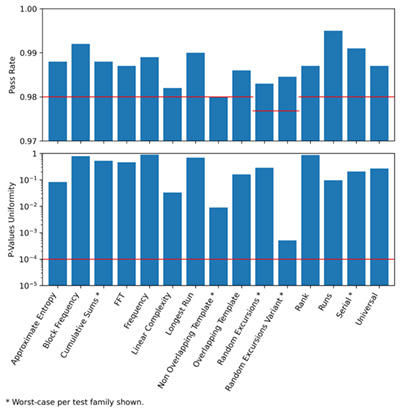
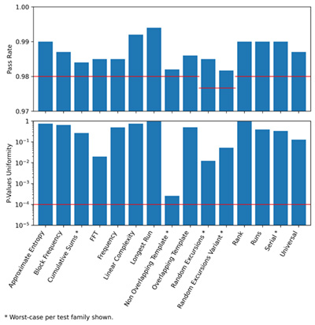
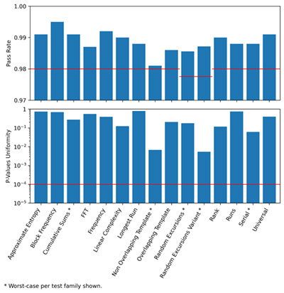
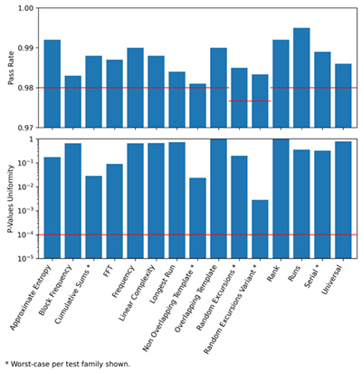

libpsijent
==========

A postprocessing-free high-quality RNG based on memory access time variations measured using low-level CPU cycle clock.

NIST SP 800-22 Result
---------------------

#### Windows 10 (Ryzen 7 2700X)

#### Debian 13 (i7-8559U)

#### Android 11 (Snapdragon 765G)

#### macOS Sequoia (M4 Pro)

`-DPSIJENT_MEM_SIZE=268435456 -DPSIJENT_MEM_LOC_MASK=268435455 -DPSIJENT_MEM_MIN_JMP_DIST=117440512 -DPSIJENT_MEM_RAND_JMP_MASK=16777215`

License
-------

    Copyright (C) 2026 NullSpook
    
    libpsijent is free software: you can redistribute it and/or modify it under
    the terms of the GNU Affero General Public License as published by the Free
    Software Foundation, either version 3 of the License, or (at your option)
    any later version.
    
    psijent is distributed in the hope that it will be useful, but WITHOUT ANY
    WARRANTY; without even the implied warranty of MERCHANTABILITY or FITNESS
    FOR A PARTICULAR PURPOSE.  See the GNU Affero General Public License for
    more details.
    
    You should have received a copy of the GNU Affero General Public License
    along with psijent.  If not, see <https://www.gnu.org/licenses/>.