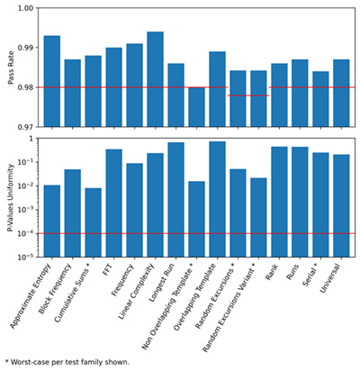

libpsijent
==========

A postprocessing-free* jitter-based true random number generator (TRNG) designed for psi experiments.

\* Postprocessing available as optional features.

Optional features
-----------------

- **LFSR-based decorrelation** `decorrelate_with_lfsr`

  Reference: https://forum.mindmatterinteraction.net/t/increasing-mmi-effect-size-by-lfsr-processing-of-mmi-bits/96/5

- **XOR-masking with PRNG** `mask_with_prng`

  Reference: https://web.archive.org/web/20260311072125/https://noosphere.princeton.edu/reg.html

- **Random walk bias amplification** `bias_amplification_level`
  _(applied **after** decorrelation and masking if they are enabled)_

  Reference: https://forum.mindmatterinteraction.net/t/caution-high-entropy-zone/82/6

NIST SP 800-22 Result
---------------------

**Mac mini M4 Pro *(no postprocessing)***



Install
-------

```bash
mkdir build
cd build
cmake ..
make
sudo make install
```

Usage
-----

```c
#include <stdio.h>
#include <stdint.h>
#include <stdbool.h>

#include <psijent.h>

int main(void)
{
    psijent *p;

    if (psijent_init(&p) != 0) {
        return 1;
    }

    uint8_t buffer[16];

    psijent_randbytes(
        p,
        buffer,
        16,
        false,  // decorrelate_with_lfsr
        true,   // mask_with_prng
        0       // bit_bias_amplification_level
    );

    for (int i = 0; i < 16; i++) {
        printf("%02X ", buffer[i]);
    }

    psijent_free(p);

    return 0;
}
```

License
-------

    Copyright (C) 2026 NullSpook
    
    libpsijent is free software: you can redistribute it and/or modify it under
    the terms of the GNU Affero General Public License as published by the Free
    Software Foundation, either version 3 of the License, or (at your option)
    any later version.
    
    psijent is distributed in the hope that it will be useful, but WITHOUT ANY
    WARRANTY; without even the implied warranty of MERCHANTABILITY or FITNESS
    FOR A PARTICULAR PURPOSE.  See the GNU Affero General Public License for
    more details.
    
    You should have received a copy of the GNU Affero General Public License
    along with psijent.  If not, see <https://www.gnu.org/licenses/>.